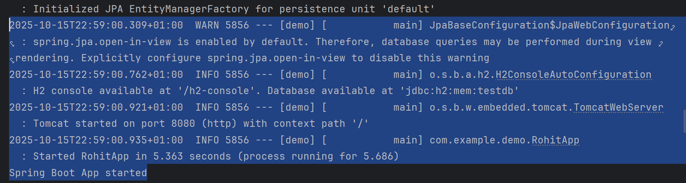
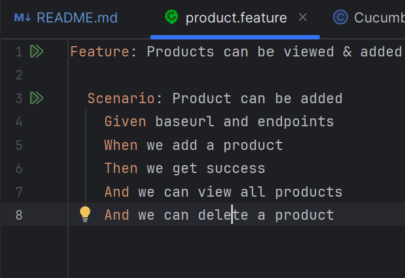

# Self Learning practice of Spring Boot

## what it do for now - Simple contract
- add productname and it's price as json request
- view all product and their price json response
- delete a product by productName

# building the project and running tests
## build springboot app
- have java 17
- build using gradle as this is gradle project

run `src/main/java/com/example/demo/RohitApp.java` as simple java app. remember spring boot don't need war or separate server. comes with it's own server.


### running cucumber tests
- ensure ur intellij has cucumber plugin.
- right click `src/acceptance/java` and select `mark direct as` (last option) , select ->  test source root
- open `src/acceptance/resources/features/product.feature` file.
- you should get play button for the feature, which will allow to run the feature file


## Basic of Spring Boot to Practice
Most basic thing about Spring Boot repo structure:
- controller package: defines entry points
- service: controllers call the service it depends on
- model: database/Datastructure model
- repository: extends JpaRepository to access CRUD functions
- App class to contain @SpringBootApplication annotation, and  SpringApplication.run(YourApp.class, args);

delete jpa call needed @Transactional

POST

Example: 
using curl

```
curl -X POST "http://localhost:8080/shop/products" -H "Content-Type: application/json" -d "{\"productName\":\"TV\", \"productCost\":155}"
```

### get all products
```
curl -X GET "http://localhost:8080/shop/products/all"
```

### Deletion curl 
```
curl -X DELETE "http://localhost:8080/shop/products/mobile"
```

### GET Shop
```shell
curl -X GET "http://localhost:8080/shop/shop"
```

```shell
curl -X GET "http://localhost:8080/shop/products/mobile"
```
